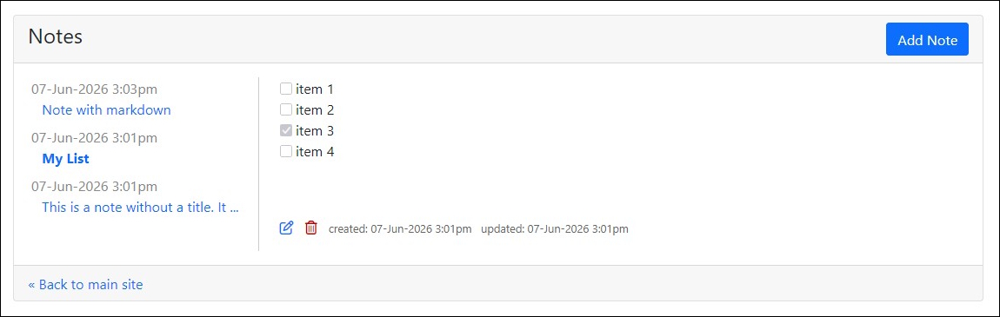
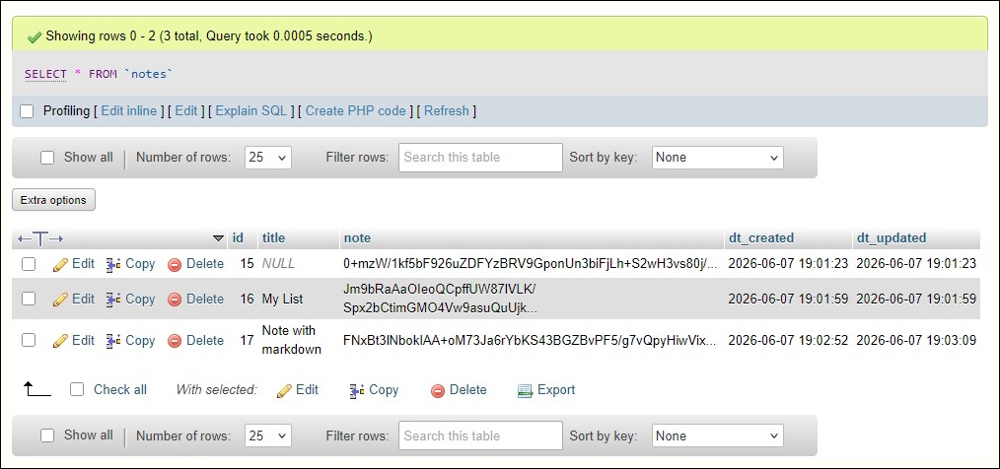

# Notes-App
Personal notes app with API

## Background
There are a thousand of these custom implementations online, but I was curious and bit bored.  Nothing groundbreaking here. It's a fairly basic personal notes app with Markdown support and an additional API for example usage. (Currently only with GET method implemented.) I originally made it for myself, so is a single-user app. 

## What You'll Need
- a web host
- PHP
- MySQL

## My Approach
I started with inspiration and core code from fundaofwebit.com's ["PHP Ajax CRUD with Bootstrap Modal without page reload"](https://www.fundaofwebit.com/post/php-ajax-crud-operations-without-page-reload-using-jQuery-Ajax-mySQL). I cleaned it up to better adhere to PHP and MySQL security and best practices (including note encryption), added Markdown support, and made some markup corrections for W3C validation. As the referenced article suggests, this uses Bootstrap and jQuery for modal operations.

## Installation
1. Create a database table "notes" with 5 columns:
   - id (int, auto-increment)
   - title (text, nullable)
   - note (text)
   - dt_created (datetime)
   - dt_updated (datetime)
2. Grab relevant source files.
   - Install [Parsedown](https://github.com/erusev/parsedown) for Markdown support. Note: Parsedown doesn't support task lists, which is a capability I wanted, so `index.php` contains a little custom `parseMarkdownWithTasks()` method to convert those manually.
4. To encrypt note content, generate a random key using PHP Sodium, and store it in a separate file:
   ```
   // Generate a random 256-bit key (store this securely!)
   $key = sodium_crypto_secretbox_keygen();
   // Encode for display/storage
   echo "key: " . bin2hex($key) . PHP_EOL; // hex — 64 printable chars
   ```
5. Edit `dbutil.php`
   - add mysql connection details
   - in the `decrypt_note()` and `encrypt_note()` functions, change the location to the encryption key file
6. Edit `index.php`
   - I chose to put this behind a simple PHP session/login, so hash a password and add it to line 12
   - modify `formatLocalTime()` with local timezone (notes will store in database in UTC; display will be local)

## Usage & Screenshots
CRUD operations as expected, with main list sorted by last-updated descending. Note title is optional.





## API
To help with content retrieval, the API provides a simple GET method that returns a JSON payload. Standard REST API behavior:

`[url]/notes/api/index.php/notes` to pull all notes

`[url]/notes/api/index.php/notes/[id]` to pull a single note
